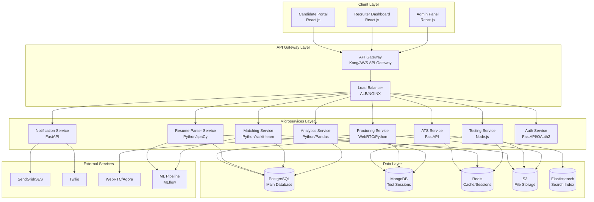
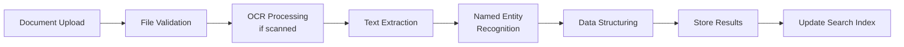

# Design Document: Recruitment & Testing Platform

## Overview

The Recruitment & Testing Platform is a comprehensive, cloud-native system built using microservices architecture to handle enterprise-scale recruitment workflows. The platform integrates AI-powered candidate screening, secure online testing, anti-cheating measures, and accessibility features to create an inclusive and efficient hiring process.

The system is designed to process high-volume recruitment activities (10,000+ applications per day) while maintaining security, compliance, and user experience standards. Key architectural principles include scalability, security-first design, accessibility compliance (WCAG AA), and real-time processing capabilities.

## Architecture

### High-Level System Architecture



### Microservices Architecture

**Service Communication:**
- **Synchronous:** REST APIs for real-time operations
- **Asynchronous:** Message queues (RabbitMQ/Apache Kafka) for event-driven workflows
- **Service Discovery:** Consul/Kubernetes DNS for service registration and discovery
- **Circuit Breaker:** Hystrix/resilience4j for fault tolerance

**Deployment Strategy:**
- **Containerization:** Docker containers for all services
- **Orchestration:** Kubernetes for container management and scaling
- **Service Mesh:** Istio for traffic management, security, and observability
- **CI/CD:** GitHub Actions with automated testing and deployment pipelines

## Components and Interfaces

### 1. Applicant Tracking System (ATS) Service

**Technology Stack:**
- **Framework:** FastAPI (Python 3.11+)
- **Database:** PostgreSQL 15+ with PostGIS extension
- **Search:** Elasticsearch 8.x for full-text search
- **Cache:** Redis for session management and frequent queries

**Core Components:**

```python
# Domain Models
class Candidate:
    id: UUID
    personal_info: PersonalInfo
    resume_url: str
    status: ApplicationStatus
    created_at: datetime
    updated_at: datetime

class JobPosting:
    id: UUID
    title: str
    description: str
    requirements: List[str]
    department: str
    location: str
    status: JobStatus
    created_by: UUID

class Application:
    id: UUID
    candidate_id: UUID
    job_id: UUID
    status: ApplicationStatus
    match_score: float
    applied_at: datetime
    stage_history: List[StageTransition]
```

**API Endpoints:**
```
POST /api/v1/candidates - Create candidate profile
GET /api/v1/candidates/{id} - Get candidate details
PUT /api/v1/candidates/{id} - Update candidate information
GET /api/v1/candidates/search - Search candidates with filters

POST /api/v1/jobs - Create job posting
GET /api/v1/jobs - List job postings with pagination
PUT /api/v1/jobs/{id} - Update job posting

POST /api/v1/applications - Submit application
GET /api/v1/applications - List applications with filters
PUT /api/v1/applications/{id}/status - Update application status
POST /api/v1/applications/bulk-action - Bulk status updates
```

**Workflow Engine:**
- **Technology:** Apache Airflow for complex recruitment workflows
- **Custom Stages:** Configurable pipeline stages per department
- **SLA Tracking:** Automated escalation for delayed applications
- **Event Triggers:** Status change notifications and automated actions

### 2. Resume Parser Service

**Technology Stack:**
- **NLP Framework:** spaCy 3.7+ with custom trained models
- **OCR Engine:** Tesseract.js for scanned documents
- **Document Processing:** PyPDF2, python-docx for file parsing
- **ML Pipeline:** scikit-learn for classification tasks

**Named Entity Recognition (NER) Model:**

```python
# Custom spaCy NER Pipeline
class ResumeNERModel:
    def __init__(self):
        self.nlp = spacy.load("en_core_web_lg")
        self.custom_ner = self.load_custom_model()
    
    def extract_entities(self, text: str) -> Dict:
        doc = self.nlp(text)
        entities = {
            'PERSON': [],
            'ORG': [],
            'DATE': [],
            'SKILL': [],
            'EDUCATION': [],
            'CERTIFICATION': [],
            'LOCATION': []
        }
        
        for ent in doc.ents:
            if ent.label_ in entities:
                entities[ent.label_].append({
                    'text': ent.text,
                    'start': ent.start_char,
                    'end': ent.end_char,
                    'confidence': ent._.confidence
                })
        
        return entities
```

**Document Processing Pipeline:**



**Supported Formats:**
- PDF (text and scanned)
- Microsoft Word (.docx)
- Plain text (.txt)
- HTML format
- RTF (Rich Text Format)

**Extraction Accuracy Targets:**
- Personal Information: 95%+
- Work Experience: 90%+
- Education: 92%+
- Skills: 88%+
- Overall Accuracy: 90%+

### 3. Intelligent Matching Service

**Technology Stack:**
- **ML Framework:** scikit-learn, pandas for data processing
- **Vector Operations:** NumPy for similarity calculations
- **Feature Engineering:** Custom transformers for text processing
- **Model Serving:** MLflow for model versioning and deployment

**Matching Algorithm Components:**

```python
class CandidateJobMatcher:
    def __init__(self):
        self.skill_vectorizer = TfidfVectorizer(max_features=5000)
        self.experience_matcher = ExperienceMatcher()
        self.education_matcher = EducationMatcher()
        self.location_matcher = LocationMatcher()
    
    def calculate_match_score(self, candidate: Candidate, job: JobPosting) -> float:
        # Skill matching (40% weight)
        skill_score = self.calculate_skill_similarity(
            candidate.skills, job.required_skills
        )
        
        # Experience matching (30% weight)
        experience_score = self.calculate_experience_match(
            candidate.experience, job.min_experience
        )
        
        # Education matching (15% weight)
        education_score = self.calculate_education_match(
            candidate.education, job.education_requirements
        )
        
        # Location matching (15% weight)
        location_score = self.calculate_location_proximity(
            candidate.location, job.location
        )
        
        final_score = (
            skill_score * 0.40 +
            experience_score * 0.30 +
            education_score * 0.15 +
            location_score * 0.15
        )
        
        return round(final_score * 100, 2)
```

**Skill Taxonomy and Matching:**
- **Skill Normalization:** Standardized skill names and synonyms
- **Semantic Matching:** Word embeddings for skill similarity
- **Industry Context:** Domain-specific skill weighting
- **Skill Levels:** Proficiency level matching (Beginner, Intermediate, Expert)

**Automated Decision Rules:**
- Auto-shortlist: Match score ≥ 80%
- Manual review: Match score 50-79%
- Auto-reject: Match score < 30% (configurable)
- Diversity filters: Ensure balanced candidate pools

### 4. Secure Testing Platform Service

**Technology Stack:**
- **Backend:** Node.js with Express.js framework
- **Real-time Communication:** Socket.io for WebSocket connections
- **Code Execution:** Docker containers with resource limits
- **Database:** MongoDB for test sessions and responses
- **File Storage:** AWS S3 for test materials and submissions

**Test Engine Architecture:**

```javascript
class TestEngine {
    constructor() {
        this.questionBank = new QuestionBank();
        this.codeExecutor = new CodeExecutor();
        this.sessionManager = new SessionManager();
        this.proctoring = new ProctoringService();
    }
    
    async startTest(candidateId, testId) {
        const session = await this.sessionManager.createSession({
            candidateId,
            testId,
            startTime: new Date(),
            status: 'active'
        });
        
        const questions = await this.questionBank.getRandomizedQuestions(testId);
        await this.proctoring.initializeSession(session.id);
        
        return {
            sessionId: session.id,
            questions: questions,
            timeLimit: session.timeLimit
        };
    }
}
```

**Question Types and Implementation:**

1. **Multiple Choice Questions (MCQ):**
```javascript
{
    type: 'mcq',
    question: 'What is the time complexity of binary search?',
    options: ['O(1)', 'O(log n)', 'O(n)', 'O(n²)'],
    correctAnswer: 1,
    points: 10,
    timeLimit: 60
}
```

2. **Coding Assessments:**
```javascript
{
    type: 'coding',
    question: 'Implement a function to reverse a linked list',
    language: 'python',
    starterCode: 'def reverse_list(head):',
    testCases: [
        { input: '[1,2,3,4,5]', expected: '[5,4,3,2,1]' }
    ],
    points: 25,
    timeLimit: 1800
}
```

**Code Execution Environment:**
- **Sandboxing:** Docker containers with restricted network access
- **Resource Limits:** CPU (1 core), Memory (512MB), Time (5 seconds)
- **Supported Languages:** Python, JavaScript, Java, C++, C#, Go
- **Security:** No file system access, no network calls
- **Monitoring:** Resource usage tracking and automatic termination

### 5. Anti-Cheating and Proctoring Service

**Technology Stack:**
- **WebRTC:** Real-time video/audio streaming
- **Computer Vision:** OpenCV, face-api.js for facial recognition
- **Browser APIs:** Screen Capture API, Page Visibility API
- **Video Processing:** FFmpeg for video compression and storage

**Browser Lockdown Implementation:**

```javascript
class BrowserLockdown {
    constructor() {
        this.violations = [];
        this.warningCount = 0;
        this.maxWarnings = 2;
    }
    
    initialize() {
        // Disable right-click context menu
        document.addEventListener('contextmenu', e => e.preventDefault());
        
        // Disable keyboard shortcuts
        document.addEventListener('keydown', this.handleKeyDown.bind(this));
        
        // Monitor window focus/blur
        window.addEventListener('blur', this.handleWindowBlur.bind(this));
        
        // Enable fullscreen mode
        this.enterFullscreen();
        
        // Start screen recording
        this.startScreenRecording();
    }
    
    handleWindowBlur() {
        this.violations.push({
            type: 'window_switch',
            timestamp: new Date(),
            severity: 'medium'
        });
        
        this.warningCount++;
        if (this.warningCount > this.maxWarnings) {
            this.autoSubmitTest();
        }
    }
}
```

**Screen Recording System:**

```javascript
class ScreenRecorder {
    async startRecording() {
        try {
            const stream = await navigator.mediaDevices.getDisplayMedia({
                video: {
                    width: 1920,
                    height: 1080,
                    frameRate: 15
                },
                audio: false
            });
            
            this.mediaRecorder = new MediaRecorder(stream, {
                mimeType: 'video/webm;codecs=h264',
                videoBitsPerSecond: 2500000
            });
            
            this.mediaRecorder.ondataavailable = this.handleDataAvailable.bind(this);
            this.mediaRecorder.start(30000); // 30-second chunks
            
        } catch (error) {
            console.error('Screen recording failed:', error);
            this.notifyProctoringService('recording_failed');
        }
    }
    
    handleDataAvailable(event) {
        if (event.data.size > 0) {
            this.uploadVideoChunk(event.data);
        }
    }
}
```

**Facial Recognition System:**

```python
class FacialRecognitionService:
    def __init__(self):
        self.face_detector = cv2.CascadeClassifier('haarcascade_frontalface_default.xml')
        self.face_recognizer = cv2.face.LBPHFaceRecognizer_create()
        self.similarity_threshold = 0.85
    
    def verify_identity(self, current_frame, reference_image):
        current_encoding = self.extract_face_encoding(current_frame)
        reference_encoding = self.extract_face_encoding(reference_image)
        
        if current_encoding is None or reference_encoding is None:
            return {'verified': False, 'reason': 'face_not_detected'}
        
        similarity = self.calculate_similarity(current_encoding, reference_encoding)
        
        return {
            'verified': similarity >= self.similarity_threshold,
            'similarity_score': similarity,
            'timestamp': datetime.now()
        }
```

**Live Proctoring Dashboard:**

```javascript
class ProctorDashboard {
    constructor() {
        this.activeSessions = new Map();
        this.flaggedSessions = [];
        this.socket = io('/proctor');
    }
    
    displayCandidateGrid(sessions) {
        const grid = document.getElementById('candidate-grid');
        grid.innerHTML = '';
        
        sessions.forEach(session => {
            const tile = this.createCandidateTile(session);
            if (session.flagged) {
                tile.classList.add('flagged');
                this.prioritizeSession(session);
            }
            grid.appendChild(tile);
        });
    }
    
    handleSuspiciousActivity(sessionId, activity) {
        const session = this.activeSessions.get(sessionId);
        session.violations.push(activity);
        
        if (activity.severity === 'high') {
            this.flagSession(sessionId);
            this.notifyProctor(sessionId, activity);
        }
    }
}
```

### 6. Identity Verification System

**Multi-Factor Authentication Flow:**

```python
class IdentityVerificationService:
    def __init__(self):
        self.otp_service = OTPService()
        self.facial_recognition = FacialRecognitionService()
        self.document_verifier = DocumentVerifier()
    
    async def verify_candidate_identity(self, candidate_id: str, verification_methods: List[str]):
        verification_results = {}
        
        for method in verification_methods:
            if method == 'otp_sms':
                result = await self.verify_otp_sms(candidate_id)
            elif method == 'facial_recognition':
                result = await self.verify_face_match(candidate_id)
            elif method == 'document_verification':
                result = await self.verify_government_id(candidate_id)
            elif method == 'biometric':
                result = await self.verify_fingerprint(candidate_id)
            
            verification_results[method] = result
        
        overall_verified = all(result['verified'] for result in verification_results.values())
        
        return {
            'candidate_id': candidate_id,
            'verified': overall_verified,
            'methods': verification_results,
            'timestamp': datetime.now()
        }
```

**Document Verification:**
- **OCR Processing:** Extract text from government IDs
- **Template Matching:** Verify document format and security features
- **Data Validation:** Cross-reference extracted information with candidate profile
- **Manual Review:** Human verification for complex cases

## Data Models

### Core Database Schema

```sql
-- Candidates table
CREATE TABLE candidates (
    id UUID PRIMARY KEY DEFAULT gen_random_uuid(),
    email VARCHAR(255) UNIQUE NOT NULL,
    first_name VARCHAR(100) NOT NULL,
    last_name VARCHAR(100) NOT NULL,
    phone VARCHAR(20),
    location GEOGRAPHY(POINT, 4326),
    resume_url TEXT,
    parsed_resume JSONB,
    status VARCHAR(50) DEFAULT 'active',
    created_at TIMESTAMP DEFAULT NOW(),
    updated_at TIMESTAMP DEFAULT NOW()
);

-- Job postings table
CREATE TABLE job_postings (
    id UUID PRIMARY KEY DEFAULT gen_random_uuid(),
    title VARCHAR(200) NOT NULL,
    description TEXT NOT NULL,
    requirements JSONB NOT NULL,
    department VARCHAR(100) NOT NULL,
    location GEOGRAPHY(POINT, 4326),
    employment_type VARCHAR(50) NOT NULL,
    salary_range JSONB,
    status VARCHAR(50) DEFAULT 'active',
    created_by UUID REFERENCES users(id),
    created_at TIMESTAMP DEFAULT NOW(),
    updated_at TIMESTAMP DEFAULT NOW()
);

-- Applications table
CREATE TABLE applications (
    id UUID PRIMARY KEY DEFAULT gen_random_uuid(),
    candidate_id UUID REFERENCES candidates(id),
    job_id UUID REFERENCES job_postings(id),
    status VARCHAR(50) DEFAULT 'applied',
    match_score DECIMAL(5,2),
    applied_at TIMESTAMP DEFAULT NOW(),
    updated_at TIMESTAMP DEFAULT NOW(),
    UNIQUE(candidate_id, job_id)
);

-- Test sessions table (MongoDB document)
{
    "_id": ObjectId,
    "candidate_id": UUID,
    "test_id": UUID,
    "session_id": UUID,
    "start_time": ISODate,
    "end_time": ISODate,
    "status": "active|completed|terminated",
    "responses": [
        {
            "question_id": UUID,
            "answer": Mixed,
            "time_spent": Number,
            "timestamp": ISODate
        }
    ],
    "proctoring_data": {
        "violations": Array,
        "screen_recordings": Array,
        "webcam_snapshots": Array,
        "identity_verifications": Array
    },
    "browser_events": Array,
    "final_score": Number
}
```

### Search Index Schema (Elasticsearch)

```json
{
    "mappings": {
        "properties": {
            "candidate_id": { "type": "keyword" },
            "full_name": { 
                "type": "text",
                "analyzer": "standard",
                "fields": {
                    "keyword": { "type": "keyword" }
                }
            },
            "email": { "type": "keyword" },
            "skills": {
                "type": "text",
                "analyzer": "skill_analyzer",
                "fields": {
                    "raw": { "type": "keyword" }
                }
            },
            "experience": {
                "type": "nested",
                "properties": {
                    "company": { "type": "text" },
                    "title": { "type": "text" },
                    "duration_months": { "type": "integer" },
                    "description": { "type": "text" }
                }
            },
            "education": {
                "type": "nested",
                "properties": {
                    "degree": { "type": "text" },
                    "institution": { "type": "text" },
                    "field_of_study": { "type": "text" },
                    "graduation_year": { "type": "integer" }
                }
            },
            "location": { "type": "geo_point" },
            "resume_text": { 
                "type": "text",
                "analyzer": "standard"
            },
            "created_at": { "type": "date" },
            "updated_at": { "type": "date" }
        }
    }
}
```

## Correctness Properties

*A property is a characteristic or behavior that should hold true across all valid executions of a system—essentially, a formal statement about what the system should do. Properties serve as the bridge between human-readable specifications and machine-verifiable correctness guarantees.*

Based on the prework analysis, the following properties ensure the system behaves correctly across all valid inputs and scenarios:

### Data Persistence and Integrity Properties

**Property 1: Application Storage Consistency**
*For any* candidate application submission, the system should store the application with a unique identifier and timestamp that can be retrieved later
**Validates: Requirements 1.1**

**Property 2: Status Change Audit Trail**
*For any* application status update, the system should log the change with timestamp, user, and previous/new status values
**Validates: Requirements 1.2**

**Property 3: Auto-save Persistence**
*For any* test session, candidate progress should be automatically saved every 30 seconds and be recoverable after any interruption
**Validates: Requirements 4.5**

### Resume Parsing and Data Extraction Properties

**Property 4: Multi-format Parsing Consistency**
*For any* valid resume document in PDF, DOCX, or TXT format, the parser should extract structured information including at least personal info, experience, education, and skills
**Validates: Requirements 2.1, 2.2**

**Property 5: OCR Processing Round-trip**
*For any* scanned resume document, OCR conversion followed by parsing should extract the same key information as would be extracted from the original text version
**Validates: Requirements 2.3**

**Property 6: Parsing Accuracy Threshold**
*For any* batch of resume parsing operations, the overall accuracy rate for extracting key information fields should be at least 90%
**Validates: Requirements 2.4**

**Property 7: Skill Normalization Consistency**
*For any* extracted skill, the system should map it to the same standardized skill term every time it encounters that skill or its synonyms
**Validates: Requirements 2.7**

### Candidate Matching and Scoring Properties

**Property 8: Matching Score Calculation**
*For any* candidate-job pair, the compatibility score should be calculated using exactly 40% skill matching, 30% experience, 15% education, and 15% location weighting
**Validates: Requirements 3.3**

**Property 9: Semantic Skill Matching**
*For any* two skill sets where one contains synonyms of skills in the other, the semantic matching should recognize the similarity and score appropriately
**Validates: Requirements 3.4**

**Property 10: Automated Status Transitions**
*For any* candidate with a match score above 80%, the system should automatically move them to "Shortlisted" status, and any candidate below 30% should be moved to "Rejected" status
**Validates: Requirements 3.5, 3.6**

### Testing Platform Security Properties

**Property 11: Browser Lockdown Enforcement**
*For any* active test session, the browser lockdown should prevent tab switching, right-click actions, and access to external applications
**Validates: Requirements 5.1**

**Property 12: Continuous Screen Recording**
*For any* test session, screen recording should capture the entire session duration without gaps, storing video chunks every 30 seconds
**Validates: Requirements 5.2**

**Property 13: Violation Detection and Logging**
*For any* prohibited action during a test (window switching, tab changes), the system should detect, log, and issue appropriate warnings
**Validates: Requirements 5.3**

**Property 14: Code Execution Sandboxing**
*For any* code submission, execution should occur in an isolated Docker container with enforced resource limits (CPU, memory, time)
**Validates: Requirements 4.4**

### Identity Verification Properties

**Property 15: Multi-factor Authentication Enforcement**
*For any* test session start, the system should require successful completion of all configured authentication factors before allowing access
**Validates: Requirements 6.1**

**Property 16: Facial Recognition Threshold**
*For any* facial recognition comparison, the system should only verify identity when similarity score meets or exceeds the 85% threshold
**Validates: Requirements 6.4**

**Property 17: Verification Audit Logging**
*For any* identity verification attempt, the system should log the method used, result, timestamp, and confidence score
**Validates: Requirements 6.6**

### Accessibility and Accommodation Properties

**Property 18: Time Extension Application**
*For any* candidate with approved time accommodations, the system should apply the correct time multiplier to all test components
**Validates: Requirements 7.2**

**Property 19: Screen Reader Compatibility**
*For any* page or component, screen readers should be able to navigate and read all content using ARIA labels and semantic HTML
**Validates: Requirements 7.1**

**Property 20: Alternative Format Availability**
*For any* question content, the system should provide alternative formats (audio, visual, simplified text) when requested
**Validates: Requirements 7.7**

### Communication and Notification Properties

**Property 21: Status Change Notifications**
*For any* application status change, the system should send appropriate email notifications to all relevant stakeholders within 5 minutes
**Validates: Requirements 8.1**

**Property 22: Template Variable Substitution**
*For any* notification template with variables, all placeholders should be correctly replaced with actual candidate/job data
**Validates: Requirements 8.5**

**Property 23: Calendar Integration Consistency**
*For any* interview scheduling, the system should create calendar events with correct date, time, and participant information in all integrated calendar systems
**Validates: Requirements 8.3**

### Analytics and Reporting Properties

**Property 24: Metrics Calculation Accuracy**
*For any* time period, time-to-hire calculations should accurately reflect the duration from application submission to hire decision
**Validates: Requirements 9.1**

**Property 25: Conversion Rate Calculation**
*For any* recruitment funnel, conversion rates between stages should be calculated as (candidates advancing / candidates entering stage) × 100
**Validates: Requirements 9.3**

**Property 26: Report Export Consistency**
*For any* report, the data should be identical across all export formats (PDF, Excel, CSV) with only formatting differences
**Validates: Requirements 9.7**

### Security and Compliance Properties

**Property 27: Data Encryption at Rest**
*For any* candidate data stored in the system, it should be encrypted using AES-256 encryption and only accessible through authenticated, authorized requests
**Validates: Requirements 10.1**

**Property 28: TLS Communication Security**
*For any* client-server communication, the connection should use TLS 1.3 encryption and reject connections using older protocols
**Validates: Requirements 10.2**

**Property 29: Data Deletion Compliance**
*For any* candidate data deletion request, all personal information should be permanently removed from all systems within 30 days
**Validates: Requirements 10.3**

**Property 30: Role-based Access Control**
*For any* user action, the system should only allow access to resources and operations explicitly permitted by the user's assigned role
**Validates: Requirements 10.4**

### Integration and API Properties

**Property 31: API Rate Limiting**
*For any* API key, the system should enforce a maximum of 1000 requests per hour and return appropriate rate limit headers
**Validates: Requirements 11.7**

**Property 32: Job Board Distribution**
*For any* job posting marked for external distribution, the system should successfully post to all configured job boards (LinkedIn, Indeed, local sites)
**Validates: Requirements 11.3**

**Property 33: Webhook Delivery Reliability**
*For any* system event with configured webhooks, notifications should be delivered to all registered endpoints with retry logic for failures
**Validates: Requirements 11.6**

## Error Handling

### Error Classification and Response Strategy

**System Errors:**
- **Database Connection Failures:** Implement connection pooling with automatic retry and circuit breaker patterns
- **External Service Timeouts:** Use timeout configurations with graceful degradation (e.g., disable non-critical features)
- **Memory/Resource Exhaustion:** Implement resource monitoring with automatic scaling and load shedding

**User Input Errors:**
- **Invalid File Formats:** Provide clear error messages with supported format list
- **Malformed Data:** Validate all inputs with detailed error responses
- **Authentication Failures:** Implement progressive delays and account lockout protection

**Business Logic Errors:**
- **Duplicate Applications:** Prevent duplicate submissions with clear user feedback
- **Invalid State Transitions:** Validate workflow state changes and provide corrective guidance
- **Insufficient Permissions:** Return appropriate HTTP status codes with clear permission requirements

### Error Recovery Mechanisms

```python
class ErrorRecoveryService:
    def __init__(self):
        self.retry_policies = {
            'database': RetryPolicy(max_attempts=3, backoff='exponential'),
            'external_api': RetryPolicy(max_attempts=5, backoff='linear'),
            'file_processing': RetryPolicy(max_attempts=2, backoff='fixed')
        }
    
    async def handle_resume_parsing_error(self, file_id: str, error: Exception):
        if isinstance(error, OCRError):
            # Retry with different OCR engine
            return await self.retry_with_alternative_ocr(file_id)
        elif isinstance(error, FormatError):
            # Flag for manual review
            await self.flag_for_manual_review(file_id, error)
            return {'status': 'manual_review_required', 'reason': str(error)}
        else:
            # Log and escalate
            await self.log_and_escalate(file_id, error)
            raise error
```

### Monitoring and Alerting

**Critical Alerts (Immediate Response):**
- System downtime or service unavailability
- Data corruption or loss incidents
- Security breaches or unauthorized access
- Payment processing failures

**Warning Alerts (Within 1 Hour):**
- Performance degradation (response time > 2 seconds)
- High error rates (> 5% of requests)
- Resource utilization > 80%
- External service integration failures

**Information Alerts (Daily Summary):**
- Usage statistics and trends
- Scheduled maintenance notifications
- Feature usage analytics
- System health reports

## Testing Strategy

### Dual Testing Approach

The system requires both unit testing and property-based testing to ensure comprehensive coverage:

**Unit Tests:**
- Test specific examples and edge cases
- Verify integration points between components
- Validate error conditions and exception handling
- Test UI components and user interactions
- Focus on concrete scenarios and known inputs

**Property-Based Tests:**
- Verify universal properties across all inputs
- Test system behavior with randomized data
- Validate correctness properties from the design document
- Ensure system invariants hold under all conditions
- Minimum 100 iterations per property test

### Property-Based Testing Configuration

**Testing Framework:** Hypothesis (Python) for backend services, fast-check (JavaScript) for frontend components

**Test Configuration:**
```python
# Example property test configuration
@given(
    candidate=candidates_strategy(),
    job_posting=job_postings_strategy()
)
@settings(max_examples=100, deadline=30000)
def test_matching_score_calculation(candidate, job_posting):
    """
    Feature: recruitment-testing-platform, Property 8: 
    For any candidate-job pair, the compatibility score should be 
    calculated using exactly 40% skill matching, 30% experience, 
    15% education, and 15% location weighting
    """
    score = matching_service.calculate_match_score(candidate, job_posting)
    
    # Verify score is in valid range
    assert 0 <= score <= 100
    
    # Verify component weights sum to 100%
    components = matching_service.get_score_components(candidate, job_posting)
    expected_total = (
        components.skill_score * 0.40 +
        components.experience_score * 0.30 +
        components.education_score * 0.15 +
        components.location_score * 0.15
    )
    assert abs(score - expected_total) < 0.01
```

**Test Data Generation:**
- Smart generators that create realistic test data
- Constraint-based generation for domain-specific rules
- Edge case generation for boundary conditions
- Performance testing with large datasets

### Integration Testing

**API Integration Tests:**
- End-to-end workflow testing
- Third-party service integration validation
- Database transaction integrity
- Authentication and authorization flows

**UI Integration Tests:**
- Cross-browser compatibility testing
- Accessibility compliance validation (WCAG AA)
- Mobile responsiveness testing
- User journey validation

### Performance Testing

**Load Testing:**
- Concurrent user simulation (1000+ simultaneous users)
- Database performance under load
- API response time validation (< 200ms for critical endpoints)
- Resource utilization monitoring

**Stress Testing:**
- System behavior at breaking points
- Recovery testing after failures
- Memory leak detection
- Scalability validation

### Security Testing

**Penetration Testing:**
- SQL injection and XSS vulnerability scanning
- Authentication bypass attempts
- Authorization privilege escalation testing
- Data encryption validation

**Compliance Testing:**
- GDPR compliance validation
- Data retention policy enforcement
- Audit trail completeness
- Privacy control functionality

Each property test must reference its corresponding design document property using the format:
**Feature: recruitment-testing-platform, Property {number}: {property_text}**
